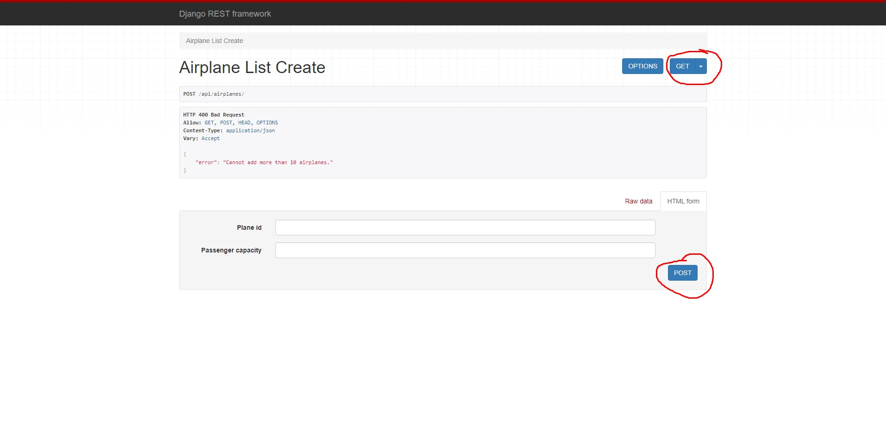

# KAMI-AIRLINES TEST

I am looking forward to working with you.

## Table of Contents

- [Installation](#installation)
- [Usage](#usage)
- [Test](#test)

## Installation

    Clone the repository.
   
    git clone https://github.com/trayanus1026/kami_airlines.git

    cd kami_airlines

    python manage.py makemigrations airlines

    python manage.py migrate

## Usage

    python manage.py runserver

    in your web browser http://localhost:8000/api/airplanes/

## Test

    python manage.py test
    
    coverage run manage.py test
    
    coverage report -m